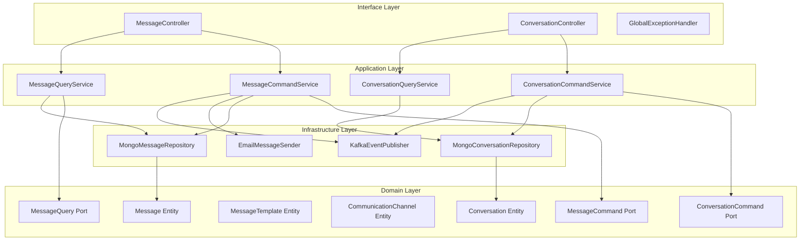

# Communication Service - Architecture Documentation

## Overview

The Communication Service is a hexagonal architecture-based multi-tenant SaaS service responsible for managing all communication aspects within the Sales Department. This includes messaging, conversations, templates, and communication channels.

## Architecture Principles

The service follows **Hexagonal Architecture** (Ports and Adapters) with clear separation of concerns:

1. **Domain Layer**: Core business logic, entities, and rules
2. **Application Layer**: Use cases and application services
3. **Infrastructure Layer**: External integrations (MongoDB, Kafka, Email)
4. **Interface Layer**: REST API endpoints

## Architecture Diagram

## Domain Model

### Message Entity

The `Message` entity represents any communication sent through the system.

**Key Properties:**
- `messageId`: Unique identifier for the message
- `tenantId`: Multi-tenant isolation
- `conversationId`: Links to a conversation
- `senderId`/`senderName`: Message sender details
- `recipients`: List of recipient information
- `channel`: EMAIL, SMS, IN_APP, WHATSAPP, PUSH_NOTIFICATION
- `status`: DRAFT, SCHEDULED, SENDING, SENT, DELIVERED, FAILED, BOUNCED, READ
- `content`: Message body
- `attachments`: File attachments
- `priority`: 1=low, 2=normal, 3=high, 4=urgent

**Business Rules:**
- Only DRAFT or SCHEDULED messages can be sent
- Messages require at least one recipient
- Content size limited to 100KB
- Attachments limited to 5MB each
- Maximum 50 recipients per message

### Conversation Entity

The `Conversation` entity organizes messages into threads.

**Key Properties:**
- `conversationId`: Unique identifier
- `tenantId`: Multi-tenant isolation
- `type`: DIRECT, GROUP, CHANNEL, SUPPORT_TICKET, SALES_CONVERSATION, MARKETING_CAMPAIGN
- `status`: ACTIVE, ARCHIVED, CLOSED, RESOLVED, ON_HOLD, PENDING
- `participants`: List of conversation participants
- `unreadCount`: Number of unread messages
- `assignedTo`: User/team assignment
- `priority`: 1=low, 2=normal, 3=high
- `relatedEntityType`/`relatedEntityId`: Links to Leads, Opportunities, etc.

**Business Rules:**
- Maximum 100 participants per conversation
- Owner cannot be removed
- SLA tracking with breach detection

## Application Services

### MessageCommandService

Handles all write operations for messages:
- `create()`: Create a new message
- `send()`: Send a message
- `markAsRead()`: Mark message as read
- `schedule()`: Schedule a message for future sending
- `delete()`: Delete draft/failed messages
- `addAttachment()`: Add attachment to draft message

### MessageQueryService

Handles all read operations:
- `getById()`: Get message by ID
- `getByConversationId()`: Get paginated messages for a conversation
- `getBySenderId()`: Get messages by sender
- `getUnreadMessages()`: Get unread messages for a user
- `searchMessages()`: Full-text search with date filters
- `getByStatus()`: Filter by delivery status

### ConversationCommandService

Handles conversation write operations:
- `create()`: Create a new conversation
- `addParticipant()` / `removeParticipant()`: Manage participants
- `update()`: Update conversation details
- `archive()` / `resolve()`: State transitions
- `assign()`: Assign to user/team
- `addTag()`: Add searchable tags
- `setSlaDeadline()`: Configure SLA tracking

## Infrastructure Components

### Persistence Layer

**MongoDB** is used as the primary database:

- `MongoMessageRepository`: Message persistence
- `MongoConversationRepository`: Conversation persistence
- `MongoMessageTemplateRepository`: Template persistence
- `MongoCommunicationChannelRepository`: Channel configuration

**Indexes:**
- Compound indexes on (tenantId, messageId)
- Indexes on conversationId, senderId, status
- TTL indexes for scheduled message cleanup

### Message Sending

**EmailMessageSender**:
- Uses Spring's JavaMailSender
- Supports HTML content
- Multiple recipients per message
- Configurable from address and name

### Event Publishing

**KafkaEventPublisher**:
- Publishes domain events to Kafka
- Events: MESSAGE_CREATED, MESSAGE_SENT, MESSAGE_DELIVERED, MESSAGE_READ
- Enables async processing and analytics

## Multi-Tenancy

The service supports multi-tenancy through:
- `tenantId` field in all entities
- Request context interceptor extracting tenant from JWT
- Repository-level filtering by tenantId
- No cross-tenant data access

## Security

- All endpoints require authentication
- Tenant isolation enforced at service level
- Role-based access control for conversation operations
- Owner/admin checks for sensitive operations

## Scaling Considerations

1. **Message Volume**: Use pagination for all list endpoints
2. **Scheduled Messages**: Background job processes due messages
3. **Event Publishing**: Async event publishing with Kafka
4. **Caching**: Redis for frequently accessed conversations

## Technology Stack

- **Language**: Java 17
- **Framework**: Spring Boot 3.1.5
- **Database**: MongoDB
- **Messaging**: Apache Kafka
- **Email**: JavaMailSender
- **API Documentation**: SpringDoc OpenAPI
- **Testing**: JUnit 5, Mockito, Testcontainers
