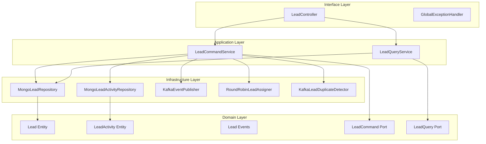

# Lead Management Service - Architecture Documentation

## Overview

The Lead Management Service is a hexagonal architecture-based multi-tenant SaaS service responsible for managing sales leads throughout their lifecycle from capture to conversion.

## Architecture Principles

The service follows **Hexagonal Architecture** (Ports and Adapters) with clear separation of concerns:

1. **Domain Layer**: Core business logic, entities (Lead, LeadActivity), and rules
2. **Application Layer**: Use cases and application services
3. **Infrastructure Layer**: External integrations (MongoDB, Kafka)
4. **Interface Layer**: REST API endpoints

## Architecture Diagram

## Domain Model

### Lead Entity

The `Lead` entity represents a potential sales opportunity.

**Key Properties:**
- `leadId`: Unique identifier
- `tenantId`: Multi-tenant isolation
- `firstName`, `lastName`, `email`, `phone`: Contact information
- `company`, `title`, `industry`: Professional details
- `source`: Lead source (WEB, EMAIL, SOCIAL, EVENT, REFERRAL, etc.)
- `stage`: Lead stage (NEW, CONTACTED, QUALIFIED, PROPOSAL, CONVERTED, LOST)
- `status`: Lead status (ACTIVE, CONTACTED, ENGAGED, STALLED, RECYCLED, CONVERTED, LOST, SPAM)
- `quality`: Lead quality (HOT, WARM, COLD, UNQUALIFIED)
- `score`: Lead score (0-100)
- `ownerId`: Assigned sales representative

**Business Rules:**
- Lead score automatically determines quality (80+=HOT, 50+=WARM, 20+=COLD)
- BANT scoring (Budget, Authority, Need, Timeline) for qualification
- Duplicate detection prevents duplicate leads
- Automatic assignment via round-robin if not specified
- Converted/lost leads cannot be modified

### LeadActivity Entity

Tracks all activities associated with a lead.

**Activity Types:**
- CALL, EMAIL, MEETING, NOTE, TASK, SMS, DEMO, WEBINAR
- STAGE_CHANGE, STATUS_CHANGE, CONVERSION, ASSIGNMENT

## Application Services

### LeadCommandService

Handles all write operations:
- `create()`: Create new lead with duplicate detection
- `update()`: Update lead details (not for closed leads)
- `assign()`: Assign to new owner
- `advanceStage()`: Move to next stage
- `regressStage()`: Move to previous stage
- `convert()`: Mark as converted to deal
- `markAsLost()`: Mark as lost with reason
- `updateScore()`: Manually update lead score
- `addActivity()`: Add activity record
- `recordInteraction()`: Record email/web interactions
- `recycle()`: Re-activate lost/stalled leads
- `delete()`: Delete lead (active only)

### LeadQueryService

Handles all read operations:
- `getById()`: Get lead by ID
- `getAllForTenant()`: Get all leads for tenant
- `getByOwner()`: Get leads by owner
- `getByStage()`: Filter by stage
- `getByStatus()`: Filter by status
- `getBySource()`: Filter by source
- `search()`: Full-text search
- `getRecentActivities()`: Get recent activities

## Infrastructure Components

### Persistence Layer

**MongoDB** is used as the primary database:
- `MongoLeadRepository`: Lead persistence
- `MongoLeadActivityRepository`: Activity persistence

**Indexes:**
- Compound index on (tenantId, email)
- Compound index on (tenantId, phone)
- Indexes on ownerId, stage, status

### Lead Assignment

**RoundRobinLeadAssigner**: Distributes leads among sales representatives using round-robin algorithm

### Duplicate Detection

**KafkaLeadDuplicateDetector**: Checks for duplicate leads by email, phone, and name similarity

### Event Publishing

**KafkaEventPublisher**: Publishes domain events:
- LEAD_CREATED
- LEAD_CONVERTED
- LEAD_LOST
- LEAD_ASSIGNED
- LEAD_QUALIFIED
- STAGE_CHANGED

## Multi-Tenancy

The service supports multi-tenancy through:
- `tenantId` field in all entities
- Request context interceptor extracting tenant from JWT
- Repository-level filtering by tenantId
- No cross-tenant data access

## Lead Scoring

**Automated Scoring:**
- Email open: +2 points
- Email click: +5 points
- Web visit: +1 point
- Form submission: +10 points

**Quality Classification:**
- Score 80-100: HOT (immediate follow-up)
- Score 50-79: WARM (nurture campaign)
- Score 20-49: COLD (periodic review)
- Score 0-19: UNQUALIFIED

## Technology Stack

- **Language**: Java 17
- **Framework**: Spring Boot 3.1.5
- **Database**: MongoDB
- **Messaging**: Apache Kafka
- **API Documentation**: SpringDoc OpenAPI
- **Testing**: JUnit 5, Mockito, Testcontainers
