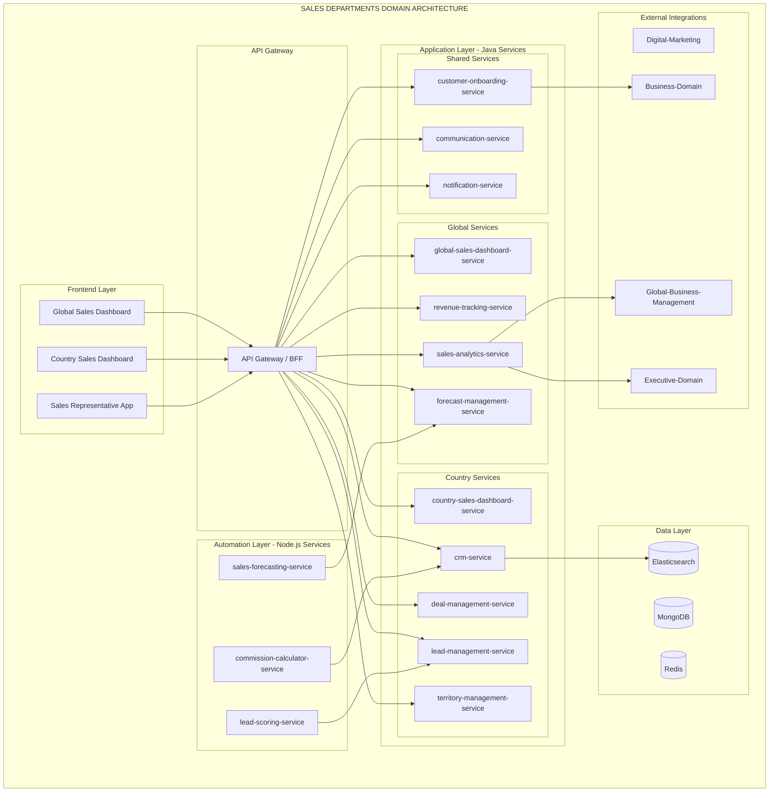
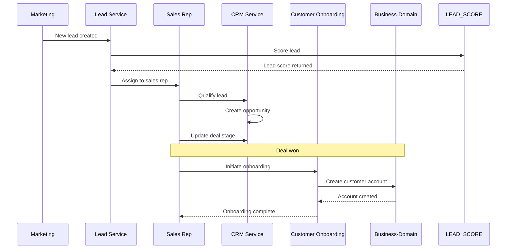

# PRD: Sales-Departments Domain

**Version:** 1.0
**Date:** 2026-01-29
**Status:** Product Requirements Document
**Domain:** Management-Domain / Sales-Departments

---

## Table of Contents
1. [Business Purpose](#business-purpose)
2. [User Personas](#user-personas)
3. [Domain Architecture](#domain-architecture)
4. [Core Features](#core-features)
5. [Service Inventory](#service-inventory)
6. [Integration Points](#integration-points)
7. [Technical Specifications](#technical-specifications)
8. [Implementation Roadmap](#implementation-roadmap)

---

## Business Purpose

### Vision
Drive revenue growth through coordinated global sales operations with local market expertise and seamless customer onboarding.

### Mission
Enable sales teams to manage leads, close deals, and nurture customer relationships through integrated CRM and sales force automation.

### Key Objectives
1. **Global Sales Visibility:** Unified view of sales across all regions
2. **Lead Management:** End-to-end lead pipeline from marketing to close
3. **Customer Onboarding:** Seamless integration with Business-Domain
4. **Performance Tracking:** Real-time sales analytics and forecasting
5. **Mobile Enablement:** Empower sales reps with mobile tools

---

## User Personas

### 1. Global Sales Director (HQ)
**Profile:** Strategic sales leader at Global HQ
**Responsibilities:**
- Global sales strategy
- Target setting and quota management
- Sales team performance oversight
- Market expansion planning

**Key Needs:**
- Worldwide sales performance dashboard
- Revenue tracking by region/country
- Sales pipeline analytics
- Forecast and quota management

### 2. Country Sales Manager
**Profile:** Local sales operations leader
**Responsibilities:**
- Local sales execution
- Team management and coaching
- Territory management
- Deal reviews

**Key Needs:**
- Local sales pipeline view
- Team performance tracking
- Deal management tools
- Territory assignment

### 3. Sales Representative
**Profile:** Field sales representative
**Responsibilities:**
- Lead qualification and conversion
- Customer meetings and presentations
- Deal closure
- Customer relationship management

**Key Needs:**
- Mobile lead management
- Customer onboarding tools
- Product catalog access
- Communication tracking

### 4. Customer (via Business-Domain)
**Profile:** Potential and existing customers
**Interaction:**
- Receive sales communications
- Purchase products/services
- Onboarding to platform

---

## Domain Architecture

### High-Level Architecture Diagram



### Data Flow Diagram



---

## Core Features

### Global Sales Dashboard

#### 1. Worldwide Sales Performance
- Total revenue by region/country
- Year-over-year growth comparison
- Sales velocity metrics
- Win/loss ratios
- Average deal size

#### 2. Revenue Tracking
- Real-time revenue dashboard
- Revenue by product/service
- Recurring vs. one-time revenue
- Revenue attribution
- Billing and collection tracking

#### 3. Sales Pipeline Analytics
- Pipeline value by stage
- Conversion funnel
- Deal velocity
- Bottleneck identification
- Pipeline health score

#### 4. Forecast and Quota Management
- Global sales forecast
- Regional quota allocation
- Quota attainment tracking
- Forecast accuracy metrics
- Risk/opportunity identification

#### 5. Team Performance Comparison
- Sales team ranking
- Performance vs. quota
- Top performers leaderboard
- Performance trends
- Coaching opportunities

#### 6. Global Customer Insights
- Customer acquisition by region
- Customer retention rates
- Customer lifetime value
- Purchase patterns
- Cross-sell/upsell opportunities

### Country Sales Dashboard

#### 1. Local Sales Pipeline
- Opportunity management
- Deal tracking and updates
- Stage progression
- Next action tracking
- Deal probability

#### 2. Customer Relationship Management (CRM)
- Customer profiles and history
- Interaction tracking
- Communication history
- Document management
- Relationship maps

#### 3. Deal Management
- Deal creation and updates
- Collaborative selling tools
- Approval workflows
- Competitive intelligence
- Deal room (shared workspace)

#### 4. Lead Management
- Lead inbox and assignment
- Lead qualification
- Lead nurturing workflows
- Lead scoring
- Lead source tracking

#### 5. Territory Management
- Territory definition and assignment
- Account allocation
- Geographic boundaries
- Territory performance
- Realignment tools

#### 6. Sales Team Performance
- Individual performance metrics
- Activity tracking
- Goal progress
- Commission tracking
- Performance coaching

### Sales Team App (Mobile)

#### 1. Customer Onboarding
- Quick customer registration
- Document collection
- Product selection
- Pricing configuration
- Submission to Business-Domain

#### 2. Lead Management
- Mobile lead capture
- Lead qualification
- Follow-up reminders
- Lead notes and tasks
- Lead status updates

#### 3. Deal Tracking
- Pipeline view
- Deal details and updates
- Activity logging
- Next actions
- Push notifications

#### 4. Customer Communication
- In-app messaging
- Email integration
- Call logging
- Meeting scheduling
- Document sharing

#### 5. Mobile Order Entry
- Product catalog browsing
- Quote creation
- Order submission
- Pricing calculator
- Discount approval

#### 6. Product Catalog Access
- Product search and filter
- Product details and specs
- Inventory availability
- Pricing information
- Cross-sell recommendations

#### 7. Competitor Intelligence
- Competitor profiles
- Battle cards
- Win/loss analysis
- Competitive positioning
- Market insights

---

## Service Inventory

### Java Backend Services (12)

| Service | Type | Description | Priority |
|---------|------|-------------|----------|
| global-sales-dashboard-service | Java | Global sales analytics | P0 |
| revenue-tracking-service | Java | Revenue aggregation and tracking | P0 |
| sales-analytics-service | Java | Sales data analysis | P0 |
| forecast-management-service | Java | Sales forecasting and quotas | P0 |
| country-sales-dashboard-service | Java | Local sales operations | P0 |
| crm-service | Java | Customer relationship management | P0 |
| deal-management-service | Java | Deal tracking and workflows | P0 |
| lead-management-service | Java | Lead pipeline management | P0 |
| territory-management-service | Java | Territory assignment | P1 |
| customer-onboarding-service | Java | Customer onboarding integration | P0 |
| communication-service | Java | Sales communication tools | P1 |
| notification-service | Java | Sales notifications | P1 |

### Node.js Backend Services (3)

| Service | Type | Description | Priority |
|---------|------|-------------|----------|
| lead-scoring-service | Node | AI-powered lead scoring | P1 |
| sales-forecasting-service | Node | Predictive sales forecasting | P1 |
| commission-calculator-service | Node | Commission calculation | P1 |

### Frontend Applications (3)

| Application | Type | Description | Priority |
|-------------|------|-------------|----------|
| global-sales-dashboard | Web | Global sales management | P0 |
| country-sales-dashboard | Web | Local sales operations | P0 |
| sales-representative-app | Mobile | Field sales tools | P0 |

---

## Integration Points

### Internal Management-Domain

```
Sales-Departments → Digital-Marketing
├── Lead handoff (marketing qualified leads)
├── Campaign performance feedback
├── Lead quality scoring
└── Closed-loop attribution

Sales-Departments → Global-Business-Management
├── Regional sales data
├── Revenue reporting
├── Forecast data
└── Performance metrics

Sales-Departments → Executive-Domain
├── Sales performance metrics
├── Revenue tracking
├── Pipeline health
└── Strategic insights
```

### Business-Domain Integration

```
Sales-Departments → Business-Domain (Country-Admin-Dashboard)
├── Customer onboarding
├── Account creation
├── Product ordering
└── Customer data sync
```

---

## Technical Specifications

### Technology Stack

#### Backend (Java)
- **Framework:** Spring Boot 3.1.5
- **Language:** Java 17+
- **Build:** Maven 3.9.12+
- **Database:** MongoDB (primary), Redis (cache), Elasticsearch (search)
- **Security:** Spring Security + JWT

#### Backend (Node.js)
- **Runtime:** Node.js 18 LTS
- **Framework:** Express.js
- **ML:** TensorFlow.js (for lead scoring)

#### Frontend (Web)
- **Framework:** React 18+ / Next.js 14
- **State:** Redux Toolkit
- **Charts:** D3.js / Recharts
- **UI:** Material-UI / Tailwind CSS

#### Frontend (Mobile)
- **Framework:** React Native
- **Navigation:** React Navigation
- **State:** Redux Toolkit
- **UI:** NativeBase / React Native Paper

### Hexagonal Architecture Compliance

All Java services MUST follow the hexagonal architecture template (see Executive-Domain PRD for details).

---

## Implementation Roadmap

### Phase 1: Foundation (Weeks 1-2)
- [ ] Set up Sales-Departments folder structure
- [ ] Configure Business-Domain integration
- [ ] Implement multi-tenancy framework
- [ ] Set up Elasticsearch for search
- [ ] Create base domain models

### Phase 2: Core Services (Weeks 3-4)
- [ ] Implement lead-management-service
- [ ] Implement deal-management-service
- [ ] Implement crm-service
- [ ] Implement customer-onboarding-service
- [ ] Build country sales dashboard

### Phase 3: Automation & Analytics (Weeks 5-6)
- [ ] Implement lead-scoring-service
- [ ] Implement sales-analytics-service
- [ ] Implement sales-forecasting-service
- [ ] Implement commission-calculator-service
- [ ] Build analytics dashboards

### Phase 4: Global Features (Weeks 7-8)
- [ ] Implement global-sales-dashboard-service
- [ ] Implement revenue-tracking-service
- [ ] Implement forecast-management-service
- [ ] Build global sales dashboard
- [ ] Data pipeline setup

### Phase 5: Mobile & Advanced (Weeks 9-10)
- [ ] Implement territory-management-service
- [ ] Implement communication-service
- [ ] Build sales representative app
- [ ] Mobile testing and optimization
- [ ] Integration testing

### Phase 6: Testing & Optimization (Weeks 11-12)
- [ ] End-to-end testing
- [ ] Performance optimization
- [ ] User acceptance testing
- [ ] Bug fixes and refinement
- [ ] Security testing

### Phase 7: Documentation (Weeks 13-14)
- [ ] Complete API documentation
- [ ] User training materials
- [ ] Sales playbooks
- [ ] Admin runbooks

### Phase 8: Deployment (Weeks 15-16)
- [ ] Staged rollout
- [ ] Production deployment
- [ ] Post-launch monitoring
- [ ] Performance tuning

---

## Success Metrics

### Technical Metrics
- **API Response Time:** < 250ms (p95)
- **Dashboard Load Time:** < 2 seconds
- **Search Response:** < 500ms
- **Mobile App Performance:** < 1 second screen load
- **Uptime:** 99.9%

### Business Metrics
- **Sales Team Adoption:** 100%
- **Lead Response Time:** < 1 hour
- **Deal Cycle Time:** Reduced by 25%
- **Forecast Accuracy:** > 85%
- **Revenue Growth:** Target achieved

---

## Risks and Mitigations

| Risk | Impact | Probability | Mitigation |
|------|--------|-------------|------------|
| Low sales rep adoption | High | Medium | Intuitive UX, training, incentives |
| Data synchronization issues | High | Medium | Robust integration testing, monitoring |
| Forecast inaccuracy | Medium | Medium | ML models, continuous improvement |
| Mobile performance issues | Medium | Low | Performance testing, optimization |
| Customer onboarding friction | High | Low | Streamlined process, validation |

---

**End of PRD: Sales-Departments Domain**

**Next Steps:**
1. Review and approve PRD
2. Create detailed task lists for each service
3. Begin Phase 1 implementation
