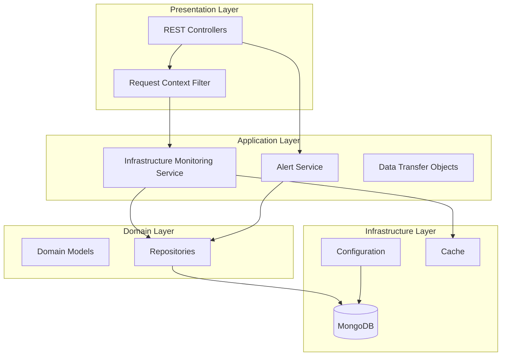
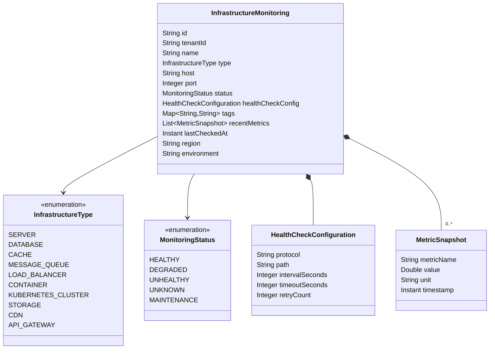
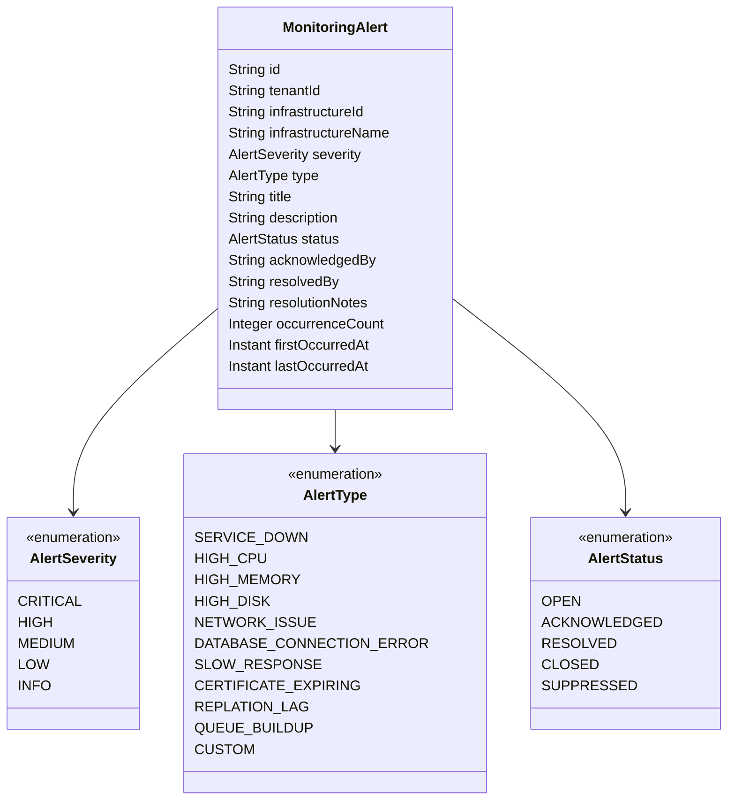

# Infrastructure Monitoring Service - Architecture

## Overview

The Infrastructure Monitoring Service is a Spring Boot microservice responsible for monitoring the health and performance of IT infrastructure components across the Gogidix ecosystem. It provides real-time visibility into servers, databases, caches, and other infrastructure elements.

## Architecture Diagram

## Layer Responsibilities

### Presentation Layer
- **InfrastructureMonitoringController**: REST endpoints for infrastructure monitoring CRUD operations
- **MonitoringAlertController**: REST endpoints for alert management
- **RequestContextFilter**: Extracts tenant/user context from HTTP headers

### Application Layer
- **InfrastructureMonitoringService**: Business logic for infrastructure monitoring
- **MonitoringAlertService**: Business logic for alert management
- **DTOs**: Data transfer objects for API communication

### Domain Layer
- **InfrastructureMonitoring**: Core domain model for monitored infrastructure
- **MonitoringAlert**: Core domain model for alerts
- **Repositories**: Data access interfaces

### Infrastructure Layer
- **MongoDB**: Document database for persistence
- **Cache**: Spring Cache abstraction
- **Configuration**: Spring Boot configuration

## Domain Model

### InfrastructureMonitoring

### MonitoringAlert

## Key Patterns

### Hexagonal Architecture
The service follows hexagonal architecture principles with clear separation between:
- **Domain**: Core business logic and models
- **Application**: Use cases and orchestration
- **Infrastructure**: External concerns (database, cache)
- **Interface**: External communication (REST API)

### Multi-Tenancy
The service supports multi-tenancy through:
- Tenant-scoped queries in repositories
- RequestContext propagation via ThreadLocal
- Tenant isolation filters

### Builder Pattern
Domain models use the Builder pattern for flexible object creation.

## Technology Stack

- **Framework**: Spring Boot 3.x
- **Language**: Java 17
- **Database**: MongoDB
- **Build Tool**: Maven
- **Testing**: JUnit 5, Mockito
- **Container**: Docker

## Deployment

The service is deployed as a Docker container with:
- Multi-stage build for optimized image size
- Health check endpoint for orchestration
- Actuator endpoints for monitoring
