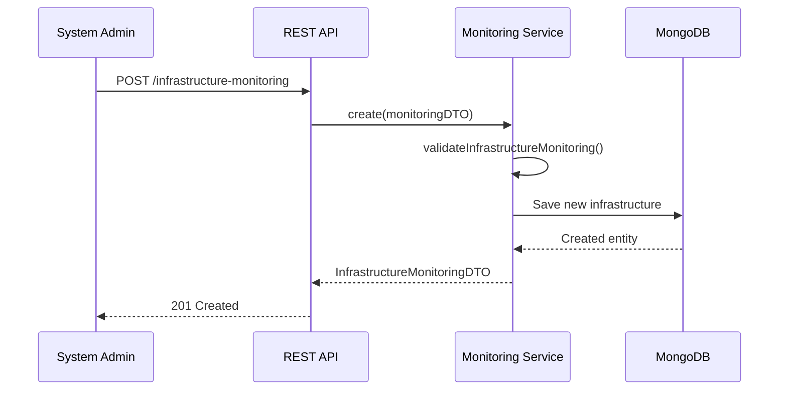
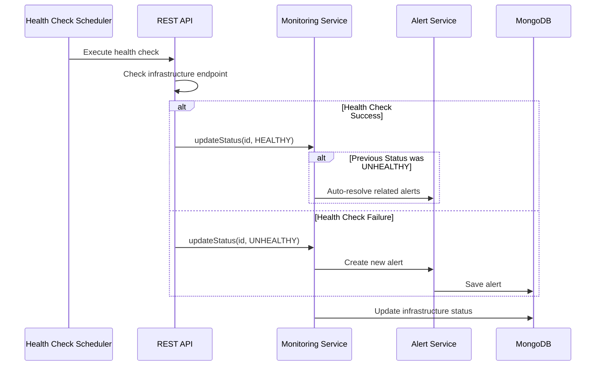
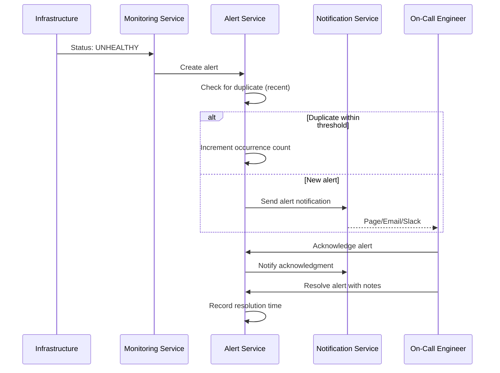
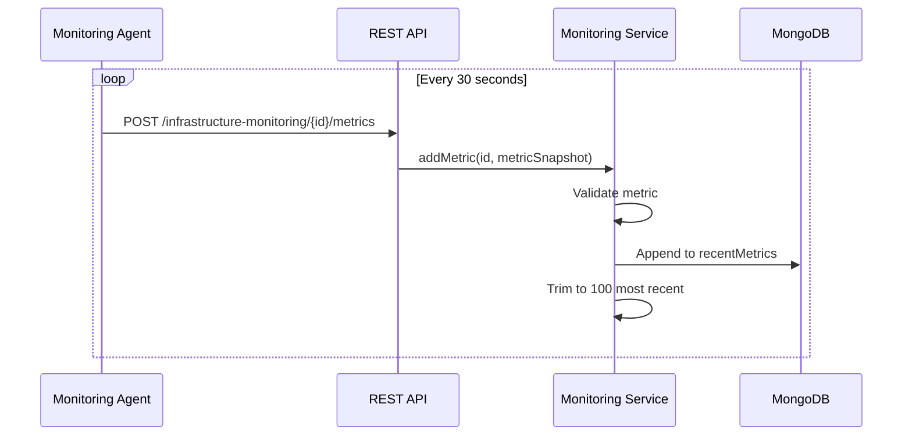

# Infrastructure Monitoring Service - Business Use Cases

## Business Purpose

The Infrastructure Monitoring Service provides real-time visibility into the health and performance of IT infrastructure across the Gogidix ecosystem. It enables proactive incident response, capacity planning, and ensures high availability of services.

## Target Users

1. **System Administrators**: Monitor infrastructure health and respond to alerts
2. **DevOps Engineers**: Track deployment impacts and infrastructure changes
3. **Site Reliability Engineers (SRE)**: Analyze performance trends and optimize infrastructure
4. **Infrastructure Managers**: Get overview of infrastructure health across environments
5. **Security Teams**: Monitor infrastructure security posture

## Core Business Processes

### 1. Infrastructure Registration

**Trigger**: New server, database, or infrastructure component is deployed

**Process Flow**:

**Business Rules**:
- Name must be unique within tenant
- Host and type are required
- Default status is UNKNOWN until first health check
- Health check configuration defaults to standard values if not provided

### 2. Health Check Processing

**Trigger**: Scheduled health check executes

**Process Flow**:

**Business Rules**:
- Health checks execute at configured intervals
- Multiple failures trigger alert creation
- Status changes from UNHEALTHY to HEALTHY auto-resolves alerts
- First check after MAINTENANCE exits maintenance mode

### 3. Alert Management

**Trigger**: Infrastructure status change or threshold breach

**Process Flow**:

**Business Rules**:
- Critical and High severity alerts trigger immediate notifications
- Duplicate alerts within 15 minutes increment occurrence count
- Alerts remain open until explicitly resolved
- Acknowledged alerts don't trigger new notifications
- Resolution notes are mandatory for audit purposes

### 4. Infrastructure Search and Filtering

**Trigger**: Administrator needs to locate specific infrastructure

**Process Flow**:
1. User applies filters (status, type, environment, region)
2. Service queries tenant-scoped data
3. Results returned with pagination
4. User can drill down to individual infrastructure

**Business Rules**:
- All queries are tenant-isolated
- Default page size is 20, maximum is 100
- Results sorted by creation date or specified field
- Search scans name and host fields

### 5. Metrics Collection

**Trigger**: Monitoring agent reports metrics

**Process Flow**:

**Business Rules**:
- Metrics retained in memory (100 most recent per infrastructure)
- Long-term storage in time-series database (separate service)
- Metrics include: CPU, memory, disk, network, response time
- Each metric includes timestamp, value, and unit

### 6. Maintenance Mode

**Trigger**: Planned maintenance window

**Process Flow**:
1. Administrator updates status to MAINTENANCE
2. Health checks paused for that infrastructure
3. Existing alerts suppressed
4. On completion, status updated to HEALTHY or previous state
5. Normal monitoring resumes

**Business Rules**:
- No alerts generated during maintenance
- Maintenance duration tracked
- Audit log records maintenance start/end

### 7. Stale Infrastructure Detection

**Trigger**: Background job checks for stale data

**Process Flow**:
1. Job runs every 5 minutes
2. Queries infrastructure with lastCheckedAt > threshold
3. Returns list to dashboard
4. May auto-create alerts for critical infrastructure

**Business Rules**:
- Threshold configurable (default: 5 minutes)
- Critical infrastructure alerts after 2 missed checks
- Non-critical infrastructure logged only

## Business Rules Summary

| Rule | Description |
|------|-------------|
| Multi-Tenancy | All data scoped by tenant ID from request headers |
| Uniqueness | Infrastructure names must be unique within tenant |
| Status Transitions | UNKNOWN → HEALTHY/DEGRADED/UNHEALTHY/MAINTENANCE |
| Alert Deduplication | Same alert within 15min increments occurrence count |
| Auto-Resolution | Status UNHEALTHY → HEALTHY auto-resolves alerts |
| Retention | Metrics limited to 100 most recent per infrastructure |
| Audit | All status changes, acknowledgments, resolutions logged |

## Key Performance Indicators (KPIs)

1. **Mean Time to Detection (MTTD)**: Time from issue occurrence to alert creation
2. **Mean Time to Acknowledgment (MTTA)**: Time from alert to acknowledgment
3. **Mean Time to Resolution (MTTR)**: Time from alert to resolution
4. **Infrastructure Availability**: Percentage of time infrastructure is HEALTHY
5. **Alert Accuracy**: Percentage of alerts that represent real issues

## Integration Points

### Upstream Services
- **Configuration Service**: Retrieves health check configurations
- **Deployment Service**: Notified of new deployments for monitoring setup
- **Environment Service**: Validates environment and region information

### Downstream Services
- **Alert Management Service**: Central alert routing and notification
- **Incident Management Service**: Creates incidents for critical alerts
- **Performance Metrics Service**: Long-term metric storage and analysis

### External Integrations
- **Cloud Providers**: AWS, Azure, GCP infrastructure APIs
- **Monitoring Tools**: Prometheus, Datadog, New Relic
- **Notification Services**: PagerDuty, Slack, Email

## Data Retention

| Data Type | Retention Period |
|-----------|------------------|
| Infrastructure Monitoring | Indefinite (until deleted) |
| Recent Metrics | 100 per infrastructure |
| Open Alerts | Indefinite |
| Acknowledged Alerts | 90 days |
| Resolved Alerts | 30 days |
