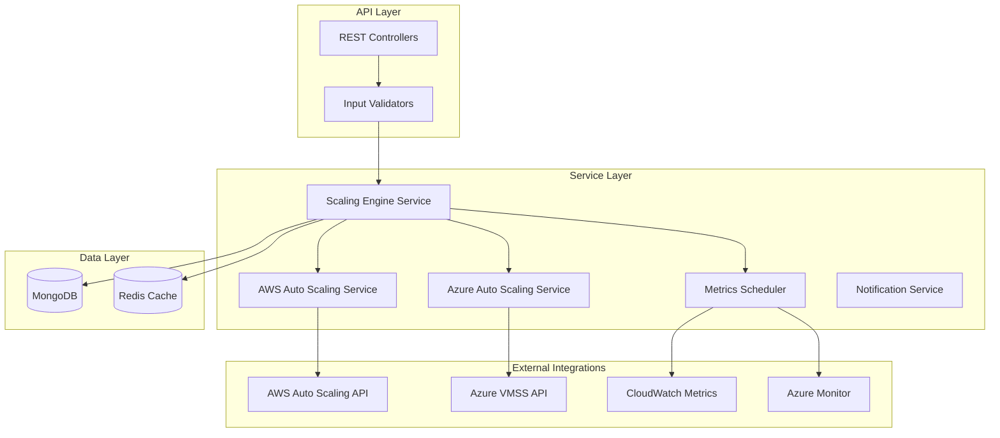
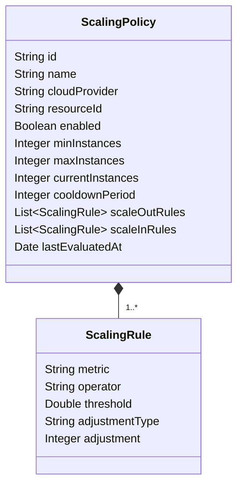
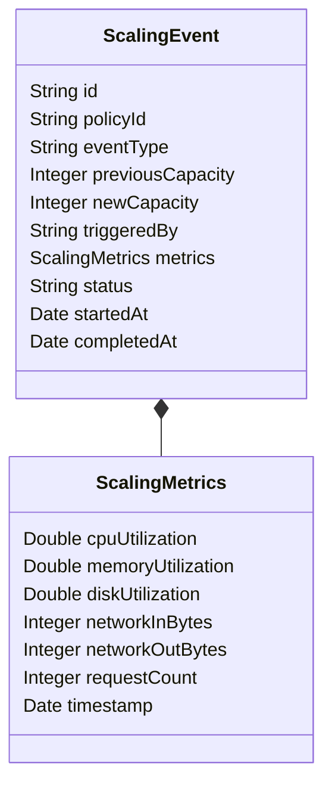
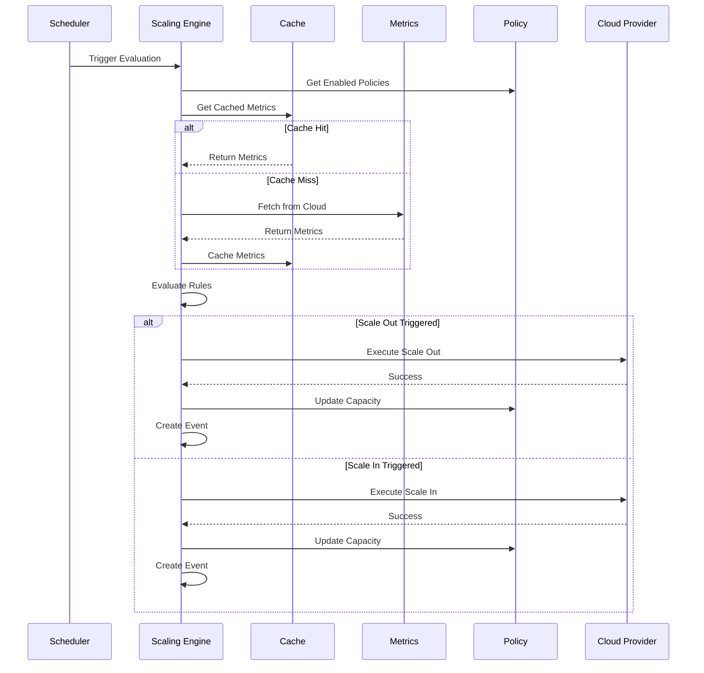

# Auto Scaling Service - Architecture

## Overview

The Auto Scaling Service is a Node.js microservice responsible for automatically scaling infrastructure resources based on metrics and predefined policies. It supports both AWS and Azure cloud providers with configurable scaling rules.

## Architecture Diagram



## Component Architecture

### Controllers

#### ScalingPolicyController
- Manages CRUD operations for scaling policies
- Enables/disables policies
- Triggers manual scaling actions
- Retrieves policy events and metrics

#### MetricsController
- Provides current metrics for resources
- Returns historical metrics data

#### ScalingEventController
- Records scaling events
- Queries event history

### Services

#### ScalingEngineService
- Singleton service managing the scaling engine
- Evaluates policies against metrics
- Triggers scaling operations
- Manages cron jobs for periodic evaluation

#### AWSAutoScalingService
- Integrates with AWS Auto Scaling Groups
- Fetches metrics from CloudWatch
- Executes scaling actions in AWS

#### AzureAutoScalingService
- Integrates with Azure VM Scale Sets
- Fetches metrics from Azure Monitor
- Executes scaling actions in Azure

#### NotificationService
- Sends notifications for scaling events
- Supports multiple notification channels

## Domain Models

### ScalingPolicy



### ScalingEvent



## Key Patterns

### Singleton Pattern
The ScalingEngineService uses the singleton pattern to ensure only one instance manages the scaling operations.

### Scheduled Execution
Cron jobs handle:
- Metrics collection (every minute)
- Policy evaluation (every 2 minutes)

### Caching
Redis caches current metrics for:
- Fast policy evaluation
- Reduced API calls to cloud providers

## Technology Stack

- **Runtime**: Node.js 18+
- **Framework**: Express.js
- **Database**: MongoDB
- **Cache**: Redis
- **Language**: TypeScript
- **Testing**: Jest
- **Scheduling**: node-cron

## Environment Variables

| Variable | Description | Default |
|----------|-------------|---------|
| PORT | Service port | 3001 |
| MONGODB_URI | MongoDB connection string | mongodb://localhost:27017 |
| REDIS_URI | Redis connection string | redis://localhost:6379 |
| AWS_ACCESS_KEY_ID | AWS access key | - |
| AWS_SECRET_ACCESS_KEY | AWS secret key | - |
| AWS_REGION | AWS region | us-east-1 |
| AZURE_SUBSCRIPTION_ID | Azure subscription ID | - |
| AZURE_CLIENT_ID | Azure client ID | - |
| AZURE_CLIENT_SECRET | Azure client secret | - |
| AZURE_TENANT_ID | Azure tenant ID | - |

## Scaling Flow



## Monitoring and Observability

### Health Check
```http
GET /health
```

### Metrics Endpoints
- `GET /api/v1/metrics/:resourceId` - Current metrics
- `GET /api/v1/metrics/:resourceId/history` - Historical metrics

### Logging
- Winston logger with multiple transports
- Structured logging format
- Log levels: error, warn, info, debug

## Deployment

### Docker Build
```bash
docker build -t auto-scaling-service .
```

### Docker Run
```bash
docker run -p 3001:3001 \
  -e MONGODB_URI=mongodb://mongo:27017 \
  -e REDIS_URI=redis://redis:6379 \
  auto-scaling-service
```

### Kubernetes Deployment
```yaml
apiVersion: apps/v1
kind: Deployment
metadata:
  name: auto-scaling-service
spec:
  replicas: 2
  selector:
    matchLabels:
      app: auto-scaling
  template:
    metadata:
      labels:
        app: auto-scaling
    spec:
      containers:
      - name: auto-scaling-service
        image: auto-scaling-service:latest
        ports:
        - containerPort: 3001
        env:
        - name: MONGODB_URI
          valueFrom:
            configMapKeyRef:
              name: app-config
              key: mongodb.uri
        - name: REDIS_URI
          valueFrom:
            configMapKeyRef:
              name: app-config
              key: redis.uri
