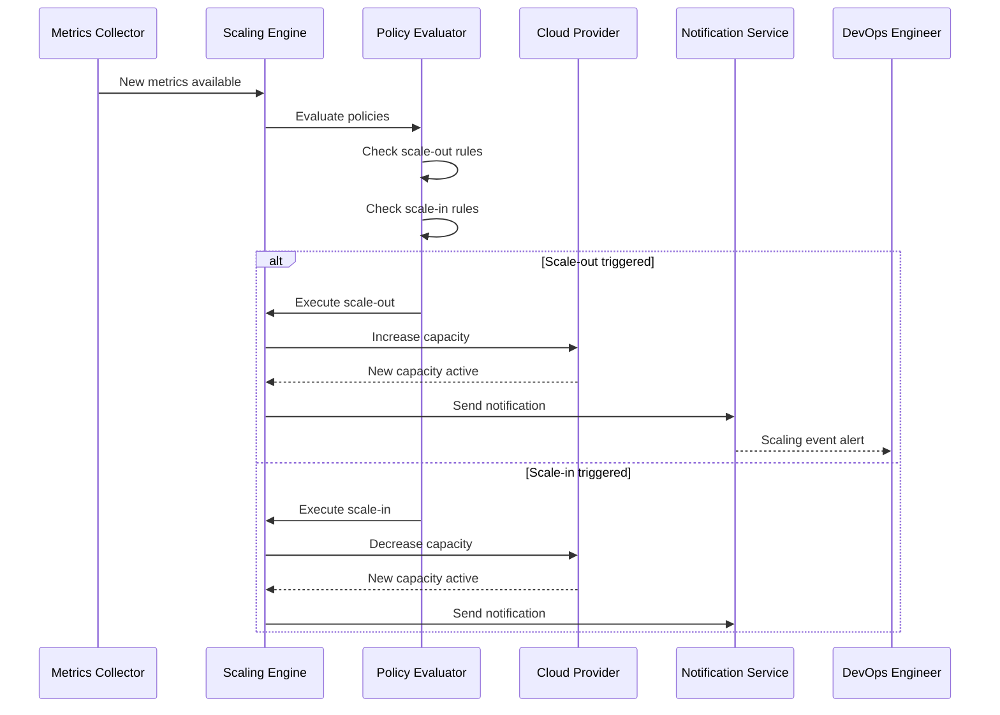
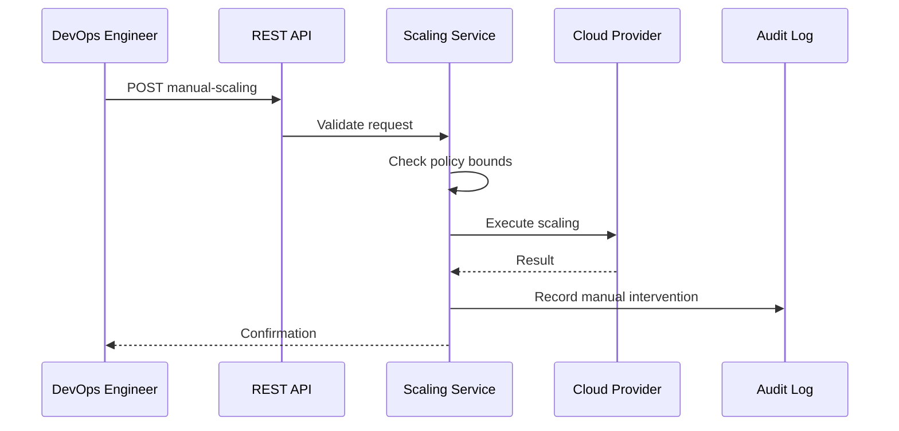

# Auto Scaling Service - Business Use Cases

## Business Purpose

The Auto Scaling Service ensures optimal resource utilization and cost efficiency by automatically adjusting infrastructure capacity based on real-time demand metrics. It prevents over-provisioning (wasting money) and under-provisioning (poor performance).

## Target Users

1. **DevOps Engineers** - Configure and manage scaling policies
2. **SRE Teams** - Monitor scaling events and system health
3. **Infrastructure Managers** - Control cloud costs through right-sizing
4. **System Administrators** - Manual scaling interventions when needed

## Core Business Processes

### 1. Policy-Based Automatic Scaling

**Trigger**: Metrics breach defined thresholds

**Process Flow:**

**Business Rules:**
- Scale-out takes priority over scale-in when both conditions met
- Cooldown period prevents rapid oscillation
- Min/max bounds are always enforced
- Failed scaling operations trigger alerts

### 2. Multi-Cloud Scaling

**Trigger**: Resources distributed across multiple clouds

**Process Flow:**
1. Administrator creates separate policies per cloud provider
2. Service integrates with AWS Auto Scaling and Azure VMSS APIs
3. Independent scaling per cloud based on local metrics
4. Consolidated view of all scaling activities

**Business Rules:**
- Each cloud has independent scaling limits
- Cloud-specific metrics account for different pricing models
- Cross-cloud policies for disaster recovery scenarios

### 3. Scheduled Scaling

**Trigger**: Predictable traffic patterns

**Process Flow:**
1. Define time-based scaling rules
2. Service adjusts capacity before expected traffic changes
3. Returns to baseline after peak period

**Use Cases:**
- Business hours vs. after-hours capacity
- Seasonal traffic variations
- Marketing event preparation

### 4. Manual Scaling Interventions

**Trigger**: Human decision required

**Process Flow:**

**Business Rules:**
- Manual scaling respects min/max bounds
- Requires justification for audit purposes
- Temporary override of automatic scaling

### 5. Scaling Event Management

**Trigger**: Scaling event occurs

**Process Flow:**
1. Event created when scaling initiated
2. Status tracked through completion
3. Failed events require investigation
4. Event history informs policy optimization

**Event States:**
- `in_progress` - Scaling operation in progress
- `completed` - Successfully finished
- `failed` - Operation failed, investigation needed

### 6. Cost Optimization

**Trigger**: Regular cost reviews

**Process Flow:**
1. Analyze scaling event history
2. Identify over-provisioned periods
3. Adjust policy thresholds
4. Reduce base capacity where possible

**Key Metrics:**
- Average instance count over time
- Scaling frequency by policy
- Cost per scaling action
- Under-utilized periods

## Business Rules Summary

| Rule | Description |
|------|-------------|
| Cooldown Period | Minimum time between scaling actions (default: 5 minutes) |
| Min/Max Bounds | Hard limits on instance count |
| Evaluation Interval | How often policies are evaluated (default: 2 minutes) |
| Metrics Freshness | Maximum age of metrics used for evaluation (default: 5 minutes) |
| Manual Override | Human operators can bypass automatic scaling |
| Multi-Cloud Independence | Each cloud scales independently |
| Audit Trail | All scaling actions logged for compliance |

## Integration Points

### Upstream Services
- **Infrastructure Monitoring Service** - Provides metrics for evaluation
- **Configuration Service** - Stores policy configurations
- **Alert Management Service** - Notifies on scaling events

### Downstream Services
- **Cloud Provider APIs** - Executes scaling operations
- **Notification Service** - Sends alerts to operators
- **Audit Service** - Records scaling history

### External Integrations
- **AWS Auto Scaling** - EC2 Auto Scaling Groups
- **AWS CloudWatch** - Metrics source for AWS resources
- **Azure VMSS** - Azure Virtual Machine Scale Sets
- **Azure Monitor** - Metrics source for Azure resources

## Key Performance Indicators (KPIs)

1. **Scaling Response Time**: Time from threshold breach to scaling action
2. **Policy Effectiveness**: Percentage of scaling actions that prevented performance issues
3. **Cost Savings**: Reduction in cloud costs through right-sizing
4. **False Positive Rate**: Scaling actions that weren't necessary
5. **Resource Utilization**: Average resource utilization across scaled resources

## Security Considerations

- Cloud provider credentials stored securely
- API access requires authentication
- Scaling actions logged for audit
- Role-based access for policy modification
- Approval workflows for large-scale changes

## Disaster Recovery

- Automatic scaling paused during major outages
- Manual scaling available as fallback
- Policy state persisted in MongoDB
- Redis cache can be rebuilt from cloud APIs
