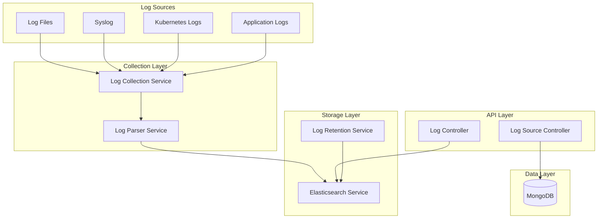

# Log Aggregation Service - Architecture

## Overview

The Log Aggregation Service is a Node.js microservice that collects, parses, and stores logs from various sources with Elasticsearch integration for powerful search and analytics.

## Architecture Diagram

## Components

### Controllers
- **LogController**: Query and retrieve logs
- **LogSourceController**: Manage log sources

### Services
- **LogCollectionService**: Collect logs from sources
- **LogParserService**: Parse various log formats
- **ElasticsearchService**: Store and search logs
- **LogRetentionService**: Apply retention policies

## Domain Models

### LogSource
- Source type (file, syslog, kubernetes)
- Connection details
- Parse format
- Collection schedule

### LogAlertRule
- Alert conditions
- Notification settings
- Rule status

## Supported Log Formats

- JSON
- Syslog
- Common Log Format (CLF)
- Combined Log Format
- Custom patterns

## Technology Stack

- **Runtime**: Node.js 18+
- **Framework**: Express.js
- **Database**: MongoDB
- **Search**: Elasticsearch
- **Language**: TypeScript
- **Testing**: Jest
