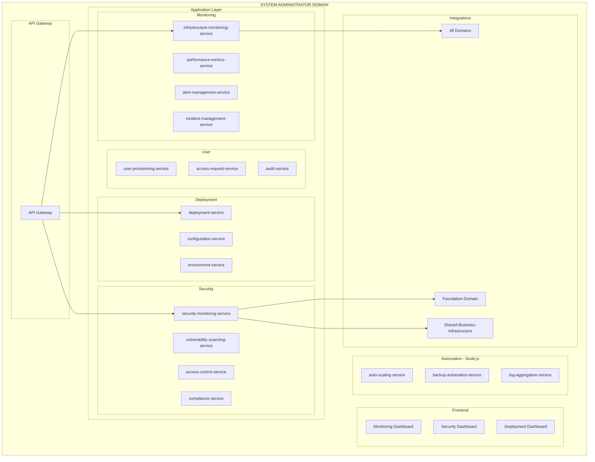

# PRD: System-Administrator Domain

**Version:** 1.0
**Date:** 2026-01-29
**Status:** Product Requirements Document
**Domain:** Management-Domain / System-Administrator

---

## Business Purpose

Ensure reliable, secure, and performant IT infrastructure across all global operations.

## User Personas

1. **Global CIO/CTO** - Technology strategy
2. **System Administrators** - Infrastructure management
3. **DevOps Engineers** - Deployment and automation
4. **Security Engineers** - Security monitoring

## Domain Architecture



## Service Inventory

### Java Backend Services (14)

| Service | Priority |
|---------|----------|
| infrastructure-monitoring-service | P0 |
| performance-metrics-service | P0 |
| alert-management-service | P0 |
| incident-management-service | P0 |
| security-monitoring-service | P0 |
| vulnerability-scanning-service | P0 |
| access-control-service | P0 |
| compliance-service | P0 |
| deployment-service | P0 |
| configuration-service | P1 |
| environment-service | P1 |
| user-provisioning-service | P0 |
| access-request-service | P0 |
| audit-service | P0 |

### Node.js Services (3)

| Service | Priority |
|---------|----------|
| auto-scaling-service | P1 |
| backup-automation-service | P0 |
| log-aggregation-service | P0 |

### Frontend (3)

| Application | Priority |
|-------------|----------|
| monitoring-dashboard | P0 |
| security-dashboard | P0 |
| deployment-dashboard | P0 |

## Integration Points

```
System-Administrator → All Domains
├── Infrastructure monitoring
├── Health checks
└── Incident response

System-Administrator → shared-business-infrastructure
├── Infrastructure health monitoring
├── Shared cores monitoring
└── Technical support
```

---

**End of PRD: System-Administrator Domain**
